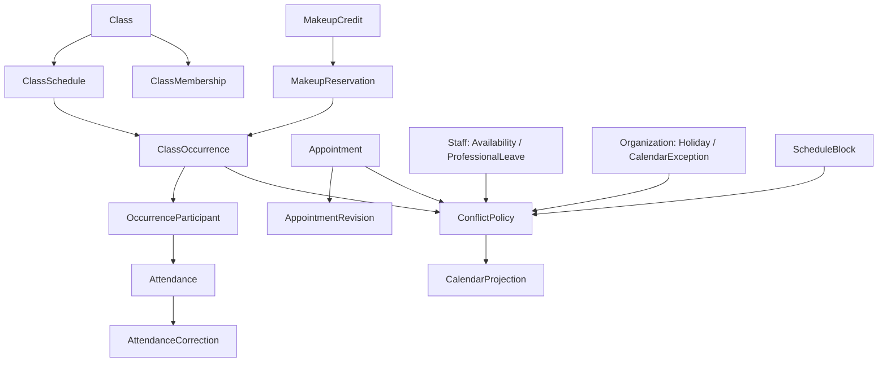

# AGENDA-002 — Contratos canônicos de Scheduling e Pilates

**Status:** APROVADO para desenho de persistência aditiva; não é migration, API nem backfill. Este documento resolve as divergências dos documentos anteriores sobre sala, snapshots, estados e ownership. Onde houver conflito, esta especificação e o ADR-010 prevalecem.

## Fronteiras e leitura consolidada

`CalendarProjection` é read model reconstruível e sem comandos de escrita. Seus itens são `CLASS_OCCURRENCE`, `APPOINTMENT` e `SCHEDULE_BLOCK`; Availability, Leave e CalendarException influenciam disponibilidade e podem ser expostos como sinais não-editáveis, mas não são itens operacionais por padrão. Não existe `calendar_events` owner universal.

## Tempo, identidade e histórico

- Datas operacionais usam `localDate` e horários civis `localStartTime`/`localEndTime` no `timeZoneId` da unidade; instantes concretos usam também `startAt`/`endAt` (`timestamptz`) derivados dessa combinação. A occurrence guarda ambos; a recorrência não usa UTC como regra semanal.
- A convenção de vigência é **[effectiveFrom, effectiveTo)**: início inclusivo, fim exclusivo, por `localDate`. `effectiveTo = null` significa aberto. Mudança em 01/11 encerra a anterior com `effectiveTo=01/11` e inicia a nova nessa mesma data.
- Dias são enum/valor canônico `MONDAY`…`SUNDAY`, serializado como coleção ordenada sem repetição; a migration poderá mapear os inteiros legados. Strings livres são proibidas.
- Todo fato histórico é preservado: mudança permanente cria nova vigência; exceção altera a occurrence; cancelamento muda estado; transferência encerra vínculo e cria outro; correção e reagendamento são append-only.

## Pilates

### Class e ClassSchedule

`Class` é a identidade lógica: `id`, `tenantId`, `unitId`, `name`, `serviceId?`, `status`, criação/ator/audit. Unidade e serviço são referências estáveis para a identidade operacional; mudança desses atributos requer comando explícito e não reinterpreta occurrences existentes.

`ClassSchedule` é versão temporal: `id`, `classId`, `effectiveFrom`, `effectiveTo?`, `weekdays`, `localStartTime`, `localEndTime`, `timeZoneId`, `plannedProfessionalId?`, `effectiveCapacity`, `roomId?`, criação/ator. Horário, profissional, capacidade e sala pertencem ao schedule porque variam por vigência. Não pode haver schedules sobrepostos para a mesma Class; a regra é garantida por intervalo [início,fim). Sala é snapshot informativo, nunca recurso exclusivo.

### ClassOccurrence

É o fato concreto derivado de uma versão: `id`, `classId`, `classScheduleId`, `unitId`, `localDate`, `timeZoneId`, `localStartTime`, `localEndTime`, `startAt`, `endAt`, `plannedProfessionalId?`, `actualProfessionalId?`, `effectiveCapacity`, `roomId?`, `status`, criação e metadados de exceção.

Estados: `PLANNED`, `IN_PROGRESS`, `COMPLETED`, `CANCELLED`. Cancelamento guarda `reason`, `cancelledBy`, `cancelledAt`; substituição e overrides pontuais guardam before/after, motivo, ator e instante no log/audit de occurrence, mantendo os valores efetivos atuais como snapshot. Snapshot obrigatório: unidade, class/schedule de origem, data/timezone/horários locais e instantes, profissional planejado/real, capacidade, sala, serviço referência/versão aplicável e status. Uma alteração futura do schedule nunca muda esses campos.

Uma occurrence existe por materialização antecipada em janela configurável: horizonte futuro e retenção histórica são **OD-AGENDA-001**. O comando recebe janela explícita `[from, to)` enquanto não há scheduler. Reexecução é idempotente por chave lógica única `(classScheduleId, localDate)`; uma nova versão não pode compartilhar a data por causa da invariante de vigência. Cancelada permanece na mesma chave e regeneração a atualiza somente pelo comando de exceção autorizado, nunca duplica.

### Membership, roster e attendance

`ClassMembership` liga `classId` e `patientId`: `effectiveFrom`, `effectiveTo?`, `status`, `enrollmentId?`, criação/ator. Matrícula é opcional. Para o mesmo paciente e Class, vigências não se sobrepõem; o mesmo paciente pode participar de Classes diferentes quando os compromissos concretos não conflitam.

`OccurrenceParticipant` é o roster histórico: `occurrenceId`, `patientId`, `sourceType` (`MEMBERSHIP`, `MAKEUP_RESERVATION`, `AD_HOC_ADMISSION`), `sourceId?`, `status`, criação/ator e motivo de cancelamento. Não é apagado: cancelamento pontual altera seu estado e libera a vaga daquela occurrence. Ao gerar occurrence, entram memberships com `effectiveFrom <= localDate < effectiveTo` (fim nulo = infinito). Criar/encerrar membership reconcilia rosters futuros ainda não concluídos, inclusive quando a data de início for retroativa; rosters concluídos/cancelados não são reescritos.

`Attendance` pertence ao `OccurrenceParticipant` (unicidade participante); mantém status atual para leitura: `PENDING`, `PRESENT`, `LATE`, `ABSENT_JUSTIFIED`, `ABSENT_UNJUSTIFIED`, `CANCELLED_IN_ADVANCE`, `CANCELLED_LATE`. `AttendanceCorrection` é append-only: `attendanceId`, before/after, reason, actor, timestamp. Correção atualiza o status materializado, sem apagar a trilha.

`MakeupCredit` é direito explícito, não derivação automática de legado: paciente, occurrence/attendance de origem, policyVersion, estado `AVAILABLE|RESERVED|COMPLETED|EXPIRED|WAIVED`, emissão, expiração opcional, motivo. `MakeupReservation` aponta para crédito e occurrence, com `RESERVED|COMPLETED|CANCELLED`; cria um `OccurrenceParticipant` de origem `MAKEUP_RESERVATION`, ocupa vaga e não cria membership. Elegibilidade, prazo e devolução são OD-AGENDA-002.

Capacidade é responsabilidade Pilates por `effectiveCapacity` e participantes que ocupam vaga. Criar membership ou reserva de reposição bloqueia a ocorrência/Classe relevante e revalida no mesmo commit; duas tentativas pela última vaga resultam em um único sucesso. Chave de idempotência do comando impede retry duplicado.

## Scheduling, Staff e Organization

`Appointment` é apenas compromisso individual/ad-hoc: tenant/unidade, patient?, professional, service?, `startAt/endAt`, `timeZoneId`, status `SCHEDULED|CONFIRMED|COMPLETED|CANCELLED|NO_SHOW`, notas administrativas mínimas e audit. Não representa turma, occurrence nem bloqueio. `AppointmentRevision` é append-only e registra antes/depois de intervalo, unidade, profissional, paciente e serviço quando mudarem, mais reason/actor/time; reagendar é comando, não estado.

`ScheduleBlock` pertence a Scheduling: escopo obrigatório de unidade e opcional de profissional (extensível a novos escopos por tipo, sem criar reserva de sala/equipamento), intervalo, reason, `ACTIVE|CANCELLED`, criação e cancelamento auditados. Cancelar não deleta.

`ProfessionalAvailability` e `ProfessionalLeave` pertencem a Staff. Availability é regra semanal versionada por profissional/unidade/timezone/vigência; Leave é intervalo concreto, tipo/motivo e estado. Scheduling apenas consulta seus contratos. `CalendarException` é a interpretação operacional, por unidade/data ou intervalo, de `Holiday`/calendário institucional de Organization e de abertura/fechamento excepcional; não altera schedules nem duplica o feriado de origem.

## ConflictPolicy e projection

`ConflictPolicy.evaluate({tenantId, unitId, patientId?, professionalId?, startAt, endAt, sourceType, sourceId?})` aplica intervalo semiaberto: `newStart < existingEnd AND existingStart < newEnd`. Examina appointments ativos, occurrences ativas, blocks, availability, leave e exceptions. Profissional conflita globalmente no tenant, inclusive entre unidades; paciente conflita quando ocupa uma occurrence por participant ativo/reserva ou appointment ativo. Membership sem occurrence não conflita. Sala e equipamento não participam. Capacidade não pertence a esta policy.

Erros estáveis propostos: `PROFESSIONAL_SCHEDULE_CONFLICT`, `PATIENT_SCHEDULE_CONFLICT`, `PROFESSIONAL_UNAVAILABLE`, `PROFESSIONAL_ON_LEAVE`, `CALENDAR_CLOSED`, `CLASS_SCHEDULE_OVERLAP`, `MEMBERSHIP_OVERLAP`, `CLASS_CAPACITY_REACHED`, `OCCURRENCE_ALREADY_EXISTS`, `INVALID_OCCURRENCE_STATE_TRANSITION`, `MAKEUP_CREDIT_NOT_AVAILABLE`.

`GetCalendarItems` recebe tenant implícito, `unitId`, `from`, `to`, `professionalId?`, `patientId?`, `type?`; autoriza todos os filtros no servidor e devolve itens com `id`, `sourceType`, `sourceId`, unidade, intervalo, status, profissional/paciente/class resumidos, occupancy/capacity e blockReason quando aplicável. Não existe `PATCH CalendarItem`; UI envia comandos ao owner.

## Commands, segurança e transição

Todos os commands recebem actor, scope, `requestId`, `expectedVersion` em edição concorrente e `idempotencyKey` em criações/retries. Validam tenant/unidade/ownership, invariantes, policy e executam estado + audit redigido + outbox na mesma transação. Erros não revelam recursos fora de escopo.

| Command | Boundary / permissão | Invariantes e efeitos |
|---|---|---|
| CreateClass, CreateClassSchedule, ChangeClassScheduleFromDate | Pilates; `classes.manage` | schedule sem overlap; nova versão encerra anterior; agenda geração idempotente |
| GenerateClassOccurrences, Update/CancelClassOccurrence | Pilates; `occurrence.update/cancel` | snapshots; mudança pontual somente occurrence; cancelamento motivado |
| Add/End/TransferClassMember | Pilates; `class_memberships.manage` | vigência e capacidade; transferência encerra+cria; reconcilia roster futuro |
| AddOccurrenceParticipant | Pilates; `occurrence.participant.manage` | capacidade e ConflictPolicy; origem rastreável |
| Record/CorrectAttendance | Pilates; `attendance.record.assigned` / `attendance.correct` | participante único; correção append-only |
| Issue/Reserve/CancelMakeup | Pilates; `makeups.manage` / override | policy, crédito e vaga no mesmo commit |
| Create/Reschedule/CancelAppointment | Scheduling; actions `appointments.*` | ConflictPolicy; revisão append-only; audit/outbox |
| Create/CancelScheduleBlock | Scheduling; `schedule_blocks.manage` | intervalo, escopo e cancelamento histórico |

Permissões seguem [matriz](../09-security/permissions-matrix.md): policy por ação + tenant + unit scope + relação do recurso. `attendance.record.assigned` exige que o profissional do ator corresponda ao profissional efetivo/designado da occurrence; não é um `if role`. Ações novas propostas acima precisam ser adicionadas ao catálogo IAM antes da implementação.

### Matriz de transição e strangler

| Legado | Novo | Estratégia |
|---|---|---|
| `group_slots` | Class + ClassSchedule | backfill posterior após profiling |
| `group_slot_memberships` | ClassMembership | backfill posterior com vigências reconciliadas |
| `class_attendances` | Occurrence + Participant + Attendance | materializar/reconciliar; `makeup_status` não é crédito |
| `appointments.group_slot_id` | ocorrência legada | leitura temporária; descontinuar, não promover a source of truth |
| appointment `blocked` | ScheduleBlock | backfill posterior |
| `makeup_status` | candidato à revisão | nunca converter automaticamente |

Fase A: schema aditivo sem escrita; B: commands novos em piloto com novo modelo como source of truth daquela jornada; C: projection lê novo modelo; D: backfill reconciliado; E: UI troca por jornada; F: legado read-only; G: remoção posterior. Dual write é proibido por padrão. Se inevitável, requer ADR complementar que defina source of truth, outbox/idempotência, compensação e relatório de reconciliação.

## Open decisions

### OD-AGENDA-001 — Janela de materialização
Pergunta: quantos dias futuros/históricos materializar? Opção A: janela fixa global; B: configuração por unidade. Impacto: custo, roster e operação. Recomendação: configuração por unidade com default conservador, definida antes do gerador.

### OD-AGENDA-002 — Política de reposição
Pergunta: elegibilidade, expiração, devolução e override do crédito? Opção A: policy versionada por unidade/serviço; B: regra global. Impacto financeiro/operacional. Recomendação: policy versionada; AGENDA-003 cria referências sem inferir regras.

### OD-AGENDA-003 — Exception e occurrence já materializada
Pergunta: exceção institucional cancela automaticamente occurrences futuras ou exige comando de publicação? Opção A: cancelamento automático auditado; B: revisão/publicação operacional. Impacto: previsibilidade e comunicação. Recomendação: B, evitando efeito silencioso sobre participantes.
